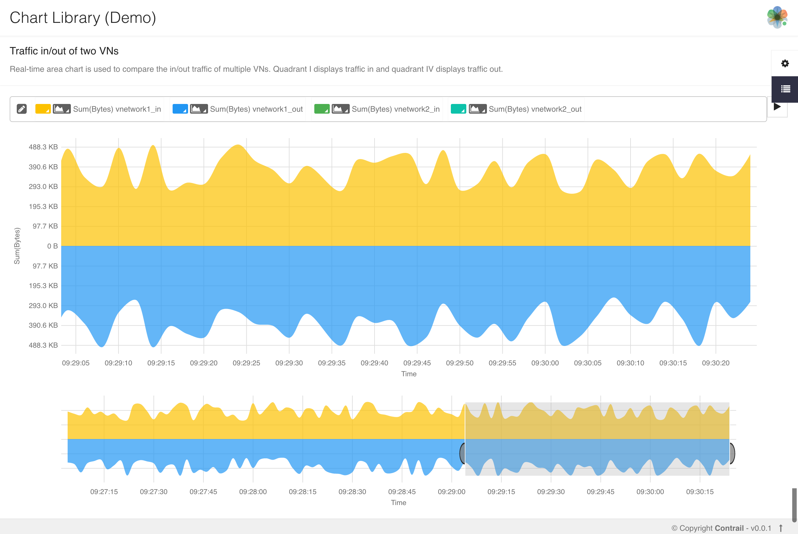

#### This is initial POC done for now released contrail-charts demo [contrail-charts-demo](https://github.com/juniper/contrail-charts-demo)

## Contrail Charts Demo

This project contains examples of charts for contrail controller using [contrail-charts](https://github.com/Juniper/contrail-charts) library. 

### Getting Started

These instructions will get you a copy of the project up and running on your local machine for development and testing purposes.

#### Prerequisites

Node version > 6

#### Installation

`npm install`

`npm start`

This will build and load the examples on browser at [http://localhost:9001](http://localhost:9001)

For dev environment, use

`npm run dev`

### Examples

#### Traffic Analysis for a Project

A combination of three charts used to analyze traffic across VNs under a project. LineBar chart shows either total traffic of this project or traffic of VN selected by clicking on Pie chart. Bubble chart shows traffic across ports with two icons: one for in-traffic and other one for out-traffic.

#### CPU & Memory of Contrail Nodes

Bubble chart with navigation is used to analyze CPU and Memory of different nodes. Each node is identified by it's temporary icon. Users can filter the nodes by CPU Share through navigation chart at bottom.

#### QE Queries on Analytics Node

Real-time Line vs Stacked Bar chart is used to compare queries and r/w requests to cassandra

#### vRouter Traffic

A radial dendrogram used to show vRouter traffic between source and destination virtual-network, IP, port.

#### Traffic in/out of VNs

Real-time area chart is used to compare the in/out traffic of multiple VNs. Quadrant I displays traffic in and quadrant IV displays traffic out.

### Authors

* [Adrian Dmitra](https://github.com/Dmitra)
* Daniel Osman
* [Sarin Kizhakkepurayil](https://github.com/skizhak)
* [Zheyang Song](https://github.com/ZheyangSong)
* [Abhishek Singla](https://github.com/absingla)

### License

This project is licensed under Apache Version 2.0 - see the [LICENSE](LICENSE) file for details
